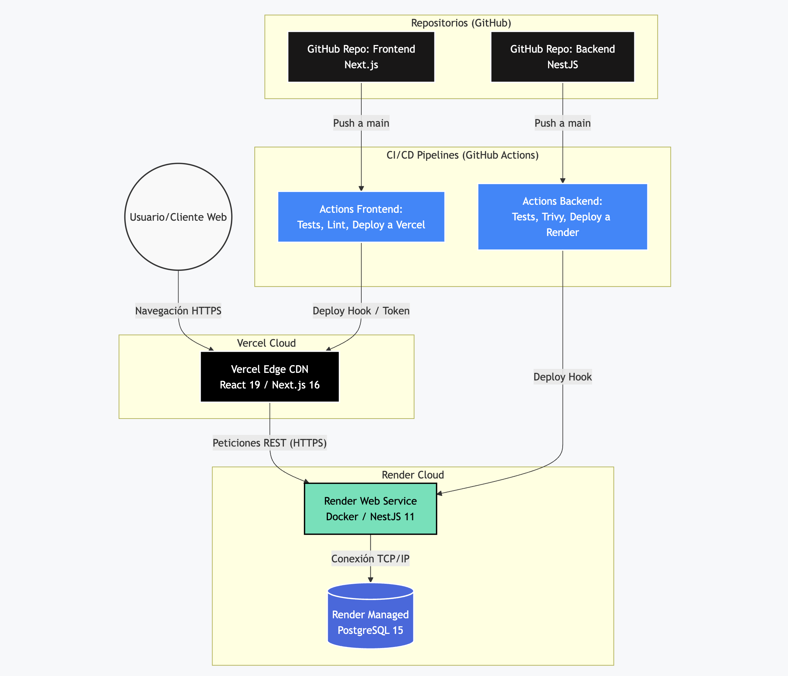
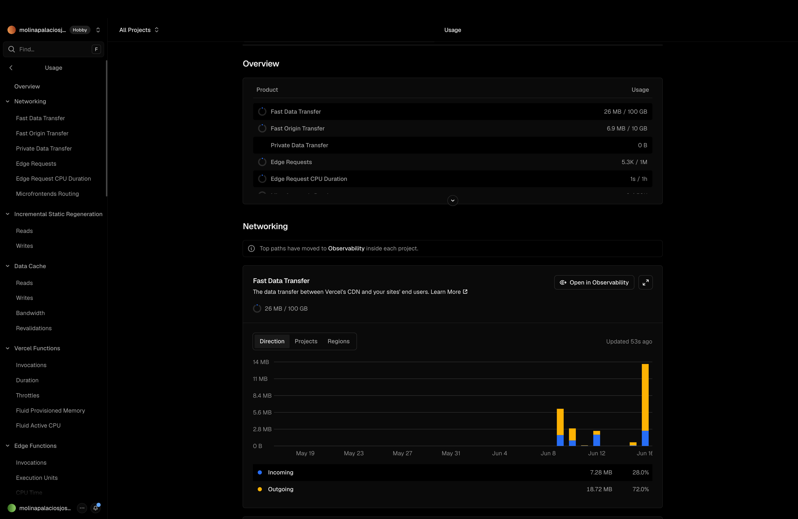
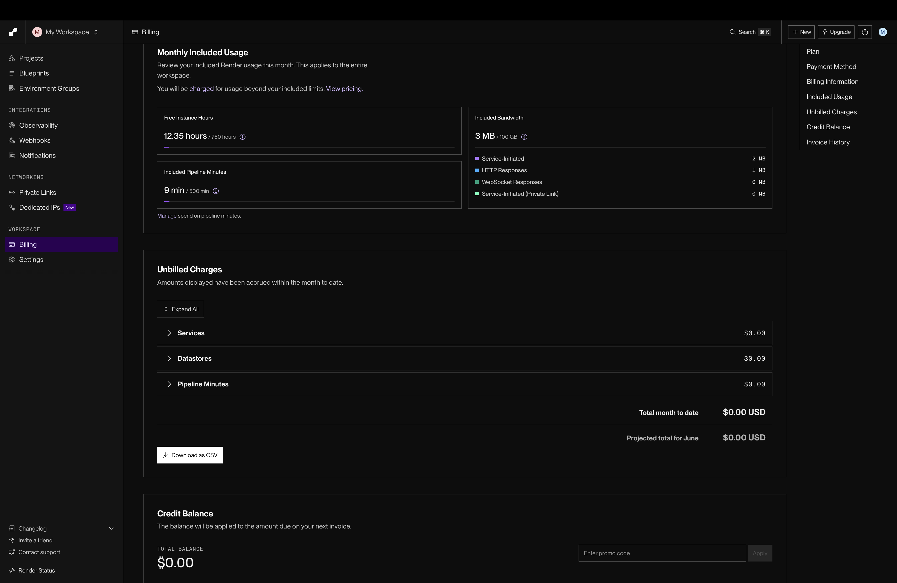
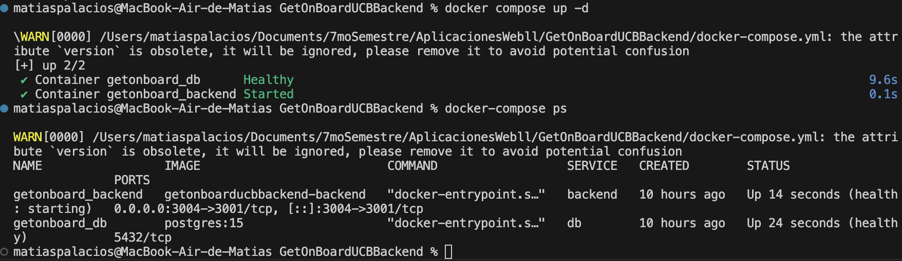
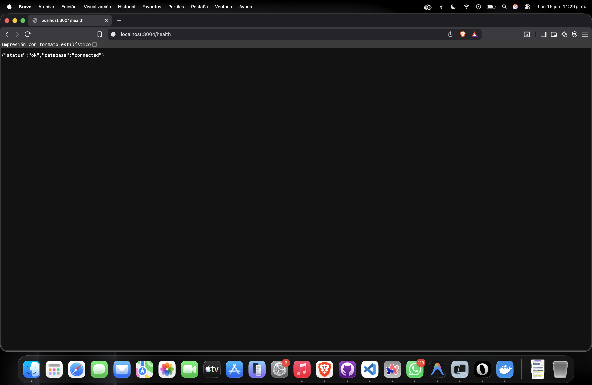
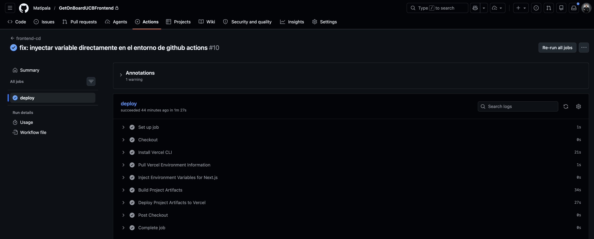
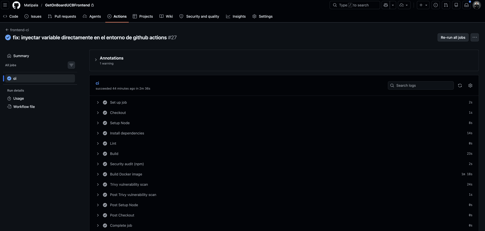
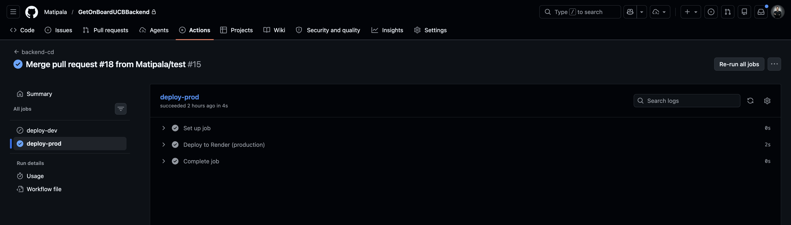
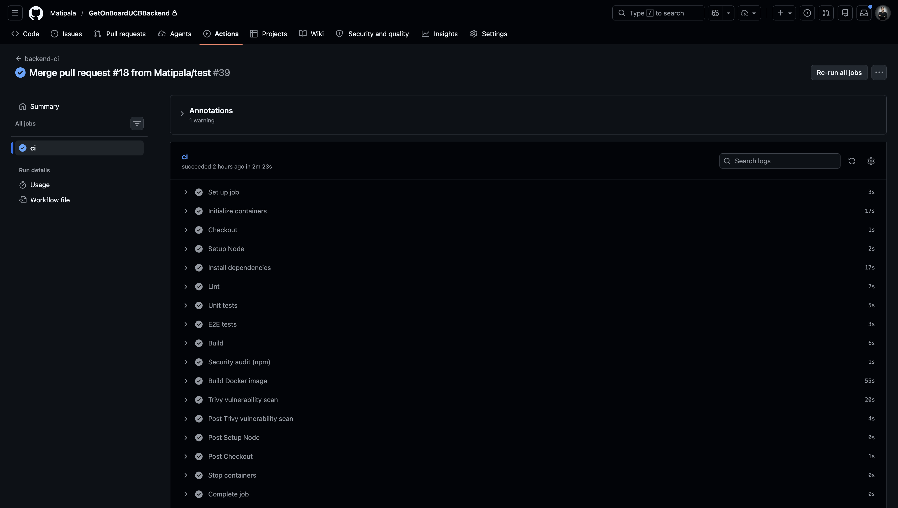

# Documentación Técnica: Proyecto Integrador GetOnBoardUCB
**Materia:** Computación en la Nube (ISW-341)

**Estudiante:** Josue Matias Molina Palacios

**Ruta Seleccionada:** RUTA B: "Bring Your Own Project" (BYOP – Inyección Cloud en Proyecto Activo)

---

## 1. Ficha Técnica del Proyecto Base

### Descripción del Software Inicial
**Nombre del Proyecto:** GetOnBoardUCB

**Propósito:** Plataforma web diseñada para gestionar ofertas laborales para pasantia, postulaciones y perfiles de estudiantes y empresas, enfocada en la Universidad Católica Boliviana.

### Tecnologías Utilizadas
*   **Backend:** NestJS 11, Node.js 22, TypeORM.
*   **Frontend:** Next.js 16, React 19, TailwindCSS.
*   **Base de Datos:** PostgreSQL 15.
*   **Gestor de Paquetes:** npm.

### Modelo de Datos (Resumen)
*   **Usuarios:** Diferenciación por roles (Admin, Employer, Coordinator, Student).
*   **Offers (Ofertas):** Detalles del trabajo, requerimientos, salarios, etc.
*   **Applications (Postulaciones):** Relación entre el estudiante y la oferta a la que postula.

### Funcionalidad CRUD
*   **Create:** Registro de usuarios, creación de nuevas ofertas de trabajo.
*   **Read:** Listado de ofertas disponibles, visualización de perfiles y postulantes.
*   **Update:** Modificación de perfiles, actualización del estado de las ofertas.
*   **Delete:** Eliminación o archivado de ofertas.

---

## 2. Declaración de Pilares Cloud Electivos

Para el cumplimiento de este proyecto, se han seleccionado y desarrollado los siguientes dos (2) pilares electivos:

1.  **PILAR 1: Contenedores y Orquestación (Docker)**
2.  **PILAR 3: Automatización de Pipelines (CI/CD)**

---

## 3. Definición de Arquitectura de Red y Nube

**Descripción Lógica de la Infraestructura:**
1.  **Código Fuente:** Almacenado en repositorios separados en **GitHub**.
2.  **Pipeline CI/CD:** **GitHub Actions** orquesta las pruebas unitarias (9 en total), análisis de seguridad (npm audit, Trivy) y el despliegue hacia entornos de producción.
3.  **Hosting del Frontend:** Desplegado nativamente en **Vercel** (Edge Network, CDN global).
4.  **Hosting del Backend & Base de Datos:** Desplegado en **Render**. Render expone el servicio web (NestJS en **Docker**) a través de su balanceador de carga y provisiona el servicio gestionado de PostgreSQL.
5.  **Flujo de Datos:** El cliente web (Vercel) consume los endpoints RESTful del Backend (Render) vía HTTPS. El backend interactúa internamente con PostgreSQL.

---

## 4. Registro de Decisiones de Arquitectura (ADR)

### # ADR-001: Separación de Repositorios (Frontend y Backend)
**Fecha:** 2026-06-5

**Estado:** Aceptada

**Decisores:** Josue Matias Molina Palacios

**Contexto y Problema:** 
El proyecto GetOnBoardUCB se compone de una API en NestJS y un cliente en Next.js. El dilema era si utilizar un monorepo o mantener repositorios separados.

**Decisión Tomada:** 
Se optó por mantener repositorios totalmente separados.

**Justificación:**
*   Permite adoptar diferentes estrategias de despliegue nativas (Vercel para Next.js, Render/Contenedores para NestJS).
*   Evita conflictos en los pipelines de CI/CD, ya que los tiempos de build y dependencias de NPM están aislados.
*   Se adapta mejor al concepto de microservicios e inyección de la nube.

**Consecuencias Positivas:** Pipelines más rápidos y limpios; control de acceso y versionado independiente.
**Consecuencias Negativas:** Mayor esfuerzo inicial en configurar dos flujos de CI/CD (GitHub Actions).

---

### # ADR-002: Uso de Render y Vercel en lugar de AWS Learner Lab
**Fecha:** 2026-06-10
**Estado:** Aceptada
**Decisores:** Josue Matias Molina Palacios

**Contexto y Problema:** 
La Ruta B permite elegir el proveedor cloud. Usar AWS Learner Lab implicaba restricciones severas con credenciales temporales cada 4 horas y límites estrictos, lo cual dificultaba la integración continua real y el despliegue productivo del frontend.

**Decisión Tomada:** 
Adoptar Vercel (Frontend) y Render (Backend) como plataformas Platform-as-a-Service (PaaS).

**Justificación:**
*   **Vercel** es el estándar óptimo y nativo para Next.js, garantizando el mejor rendimiento sin configuración manual de CDN.
*   **Render** permite conectar directamente GitHub para despliegues automatizados (Deploy Hooks) y ofrece Postgres administrado, cumpliendo los requisitos sin exponer tokens temporales.
*   Esta arquitectura Multi-Cloud es perfectamente válida según la rúbrica y acerca el proyecto a un estándar real de la industria moderna.

**Consecuencias Positivas:** CI/CD 100% automatizado, alta disponibilidad, TLS automático, menor fricción administrativa.

**Consecuencias Negativas:** Menor control a bajo nivel sobre la red (VPC) a comparación de configurar un servidor EC2 desde cero.

---

## 5. Guía de Despliegue

Para replicar y desplegar este entorno de forma local y en la nube:

### Despliegue Local (Docker)
1. Clonar ambos repositorios en el mismo directorio.
2. En el backend, renombrar `.env.example` a `.env`.
3. Ejecutar: `docker-compose up --build -d` para levantar el Backend y PostgreSQL.
4. Para validar que está corriendo, acceder a `http://localhost:3004/health`.
5. En el frontend, configurar el `.env.local` con `NEXT_PUBLIC_API_URL=http://localhost:3004`.
6. Instalar y correr el frontend: `npm ci && npm run dev`.

### Despliegue en la Nube
1.  **Base de Datos (Render):** Crear un servicio PostgreSQL gestionado. Obtener la *Internal/External Database URL*.
2.  **Backend (Render):** 
    * Crear un *Web Service* conectado a GitHub.
    * Configurar variables de entorno (DB_HOST, DB_PASSWORD, etc.).
    * En Settings, obtener el *Deploy Hook*.
3.  **Frontend (Vercel):**
    * Importar proyecto desde GitHub.
    * Definir variables de entorno (`NEXT_PUBLIC_API_URL` apuntando a Render).
4.  **Configurar CI/CD (GitHub Actions):**
    * En el repositorio backend, añadir en `Settings > Secrets` la variable `RENDER_DEPLOY_HOOK_PROD`.
    * En el repositorio frontend, añadir los tokens de Vercel (`VERCEL_TOKEN`, `VERCEL_ORG_ID`, `VERCEL_PROJECT_ID`).
    * Al hacer un push a `main`, los flujos `.github/workflows/cd.yml` se activarán y desplegarán ambos entornos automáticamente.

---

## 6. Reporte de Consumo y Costos
A continuación se adjuntan las capturas de pantalla de los paneles de "Usage/Billing" de los proveedores Cloud (Vercel y Render) que evidencian que el proyecto se mantiene bajo la capa gratuita (Free Tier).

| Proveedor Cloud | Evidencia de Consumo (Screenshot) | Estado del Plan |
| :--- | :--- | :--- |
| **Vercel** (Frontend) |  | Hobby (Free) |
| **Render** (Backend & DB) |  | Free Tier |

**Estimación Mensual (Arquitectura Free Tier):**
*   **Vercel (Frontend):** Plan Hobby. $0.00 USD/mes.
*   **Render (PostgreSQL):** Free instance. $0.00 USD/mes.
*   **Render (Backend Web Service):** Free instance. $0.00 USD/mes.
*   **GitHub Actions:** Uso de minutos incluidos en cuenta gratuita. $0.00 USD/mes.
*   **Total Estimado:** $0.00 USD. Solución económicamente viable y altamente escalable.

---

## 7. Checklist de Seguridad (Failsafe)
- [x] `.env` excluido del control de versiones en ambos repositorios (`.gitignore`).
- [x] No existen secretos, contraseñas de BD ni API Keys (Cloudinary) harcodeadas en el código.
- [x] Las credenciales se inyectan dinámicamente mediante GitHub Secrets (para CI/CD) y Variables de Entorno del proveedor (Render/Vercel).
- [x] El pipeline CI incluye escaneo de vulnerabilidades (`npm audit` / `Trivy`).

---

## Anexo: Evidencias de los Pilares

*   **Pilar 1 (Docker):**

    

    

*   **Pilar 3 (CI/CD):**

    Frontend CI/CD

    

    

    Backend CI/CD
    
    

    
